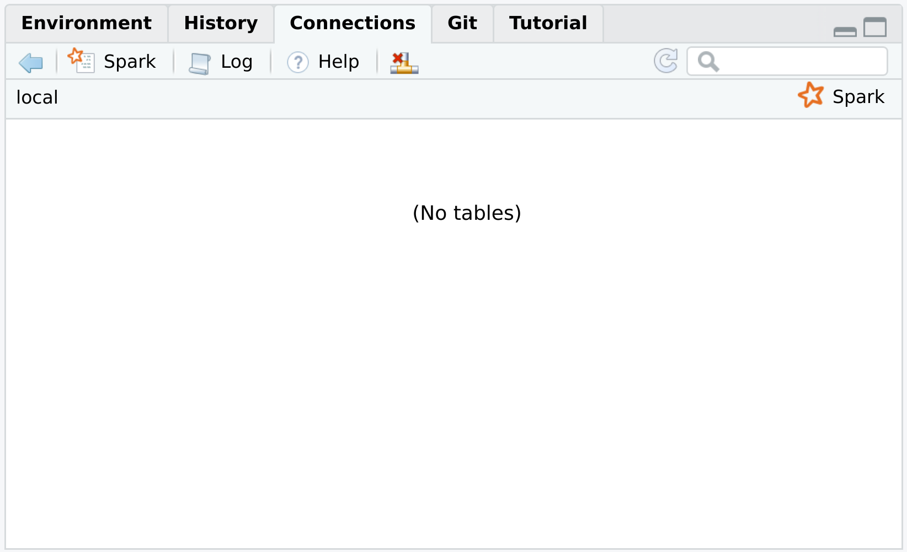
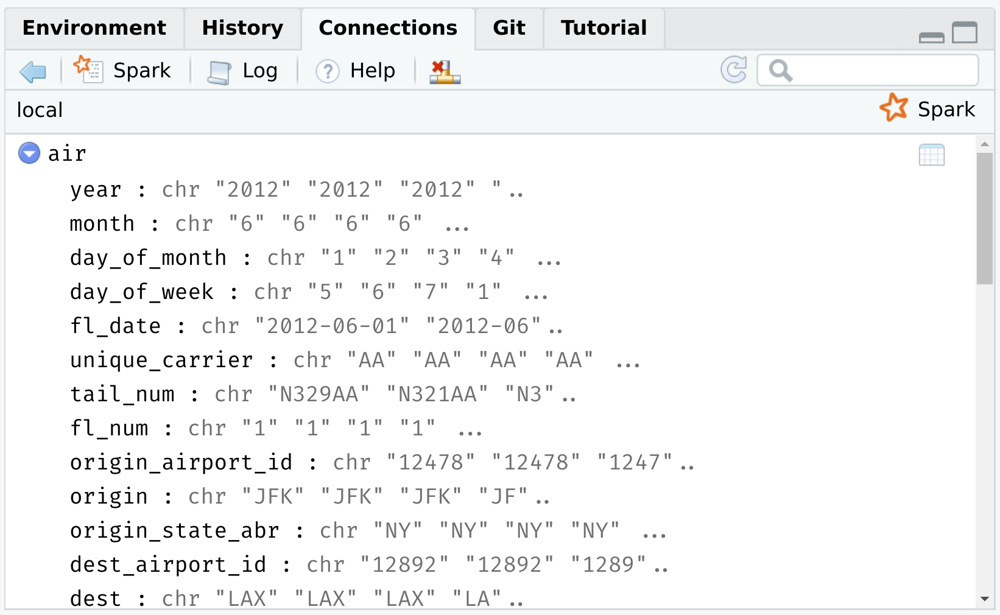

```{r setup, include=FALSE}
knitr::opts_chunk$set(echo = TRUE, cache = TRUE, dpi=300)
## Next hook based on this SO answer: https://stackoverflow.com/a/39025054
knitr::knit_hooks$set(
  prompt = function(before, options, envir) {
    options(
      prompt = if (options$engine %in% c('sh','bash')) '$ ' else 'R> ',
      continue = if (options$engine %in% c('sh','bash')) '$ ' else '+ '
      )
    })

## Spark only works with JAVA 8. 
## NOTE: Other users should change this path if they are trying to knit this 
## .Rmd file!
Sys.setenv(JAVA_HOME = "/usr/lib/jvm/java-8-openjdk")
```

<i>Note: Today's lecture is largely going to be focused on the [**sparklyr**](https://spark.rstudio.com/) package, which provides an R interface to the larger [Apache Spark](https://spark.apache.org/) ecosystem. I want to emphasize ahead of time that Spark is really designed for big data pipelines on an HPC cluster or network. These systems would normally be configured and maintained by your company or university's IT/software engineering team. We're going to emulate these big data pipelines by installing Spark on our local machines, and then explore some of the key concepts through a series of relatively simple examples. My goal is to give you a good sense of how Spark (and **sparklyr**) works and why it's so popular for big data work. The same ideas and functions that we explore today will work at much larger scale.</i>

## Requirements

A lot of work has gone into making a local Spark install as easy as possible. But we've still got quite a few steps to walk through, so please follow all of the below instructions carefully.

### Apache Spark

The **sparklyr** package provides a convenient way to install Spark on your system via the `sparklyr::spark_install()` command. Run this next code chunk interactively in your R session. Note that I am going to install a slightly older version of Spark itself (version 2.4.0 is available as of the time of writing), but I don't think this matters all that much.

```{r spark_install, eval=FALSE}
if (!require("sparklyr")) install.packages("sparklyr")
# sparklyr::spark_available_versions() ## list all available versions
sparklyr::spark_install(version = "2.3.0")
```

Installation may take a few minutes to complete, depending on your internet connection and system.

### Java 8 

Spark specifically requires Java 8. (Other versions of Java won't work!) This can be a bit finicky, so here are some platform-specific installation tips:

#### Windows 

Download the official installer [here](https://www.java.com/en/download/manual.jsp) and then follow the prompts. Please make sure that you download the 64 bit version if you are using a 64 bit machine (which almost certainly the case). Otherwise you will probably run into memory allocation errors when you try to use Spark.

I recommend that you allow it to install in the default location, which should be something like: `C:\Program Files\Java\jre1.8.0_241`. If you decide on a different install location, please take careful note of your new installation path since you will need that later.

#### Mac

It's possible to download Java 8 [here](https://www.java.com/en/download/manual.jsp). However, this official link appears to causing problems on the latest versions of OSX. Consequently, I recommend that you instead install it using [Homebrew](https://brew.sh/). From your terminal:

```{sh mac1, eval=FALSE, prompt=TRUE}
brew cask install adoptopenjdk/openjdk/adoptopenjdk8
```

This should install Java 8 to the following location: `/Library/Java/JavaVirtualMachines/adoptopenjdk-8.jdk/Contents/Home`

You can check for all Java installations on your machine by typing in the following command in your terminal:

```{sh mac2, eval=FALSE, prompt=TRUE}
ls -lh /Library/Java/JavaVirtualMachines/
```

#### Linux

You probably know what you're doing, but I recommend that you install OpenJDK 8 using your distro's package manager. See [here](https://openjdk.java.net/install/). This should install to `/usr/lib/jvm/java-8-openjdk` by default. You can list all installed Java versions on your machine with:

```{sh linux1, eval=FALSE, prompt=TRUE}
ls -lh /usr/lib/jvm
```

(Those of you who, like me, are on Arch and installed Java OpenJDK --- or OpenJFX --- through the [official repos](https://wiki.archlinux.org/index.php/Java) can also run `$ archlinux-java status`.)

#### Linking Java 8 to R

The Java 8 requirement is somewhat annoying, since there's a good chance that you have a newer version of Java installed on your system already. One way to get around this problem is to [replace your current Java installation with Java 8](https://github.com/uc-cfss/Discussion/issues/71). This will automatically make it the default Java environment and is probably the simplest solution. However, I personally don't like the idea of uninstalling the most recent Java version on my computer just to run Spark. In my view, a better solution is to install Java 8 *alongside* your current version. You can then tell R which Java version it should use via an environment variable. This works exactly the same way as when we used environment variables to save secret API keys during our webscraping and cloud computing lectures. (See [here](https://raw.githack.com/uo-ec510-2020-spring/lectures/master/08-web-api/08-web-api.html#aside:_safely_store_and_use_api_keys_as_environment_variables) if you missed it.) For example, you can tell R to use Java 8 for the current session by setting a temporary environment variable with the following command.

```{r java8, eval=FALSE}
## NB: Change to the location path of your own Java 8 installation!
# Linux: /usr/lib/jvm/java-8-openjdk
# Mac: /Library/Java/JavaVirtualMachines/adoptopenjdk-8.jdk/Contents/Home
# Windows: C:/Program Files/Java/jre1.8.0_241 ## At time of writing
Sys.setenv(JAVA_HOME = "/path/to/your/java8/installation") 
```

Again, this will only last for the current R session. However, similarly to our approach for storing API keys across sessions, you can make Java 8 the permanent environment for your R work by adding `JAVA_HOME = "/path/to/your/java8/installation"` to your `~/.Renviron` file. 

You can confirm your Java installation by running the following command.

```{r check_java}
system("java -version")
```

> **Tip:** If you're running Windows, the above command might give you a random number like "127" until you restart your system.

If you're having trouble with Java installation, then please consult the [*Mastering Spark with R*](https://therinspark.com/starting.html#starting-prerequisites) book.

### R packages 

- New: **sparklyr**, **dbplot**
- Already used: **tidyverse**, **hrbrthemes**, **httr**, **here**

As per usual, the code chunk below will install (if necessary) and load all of these packages for you.

```{r packages, cache=FALSE, message=FALSE}
## Load/install packages
if (!require("pacman")) install.packages("pacman")
pacman::p_load(tidyverse, hrbrthemes, httr, sparklyr, dbplot, here)
## My preferred ggplot2 theme (optional)
theme_set(hrbrthemes::theme_ipsum())
```

### Data

Finally, we'll be exploring Spark's capabilities using monthly air traffic data from 2012.^[This will look very familiar to the data that we've already seen in the **nycflights13** package, albeit from a different year and not limited to New York. Note that both of these datasets come from a much larger collection of flight information that is curated by the Research and Innovative Technology Administration (RITA) in the Bureau of Transportation Statistics. Siailrly, Revolution Analytics also offer the possiblity of [downloading](https://packages.revolutionanalytics.com/datasets/AirOnTime87to12) monthly flight data from 1987 to 2012.] The data consist of 12 CSV files that first need to be downloaded from [Revolution Analytics](https://packages.revolutionanalytics.com/datasets/) and then saved to `data/` subdirectory of this lecture. You can do that manually if you like, but here are some commands to do everything from R.

```{r air_download1, message=FALSE, results='hide'}
# library(here) ## Already loaded
# library(httr) ## Already loaded
# library(stringr) ## Already loaded (via tidyverse)

dir_path <- here("16-spark/data/")

## Create data sub-directory if it doesn't already exist
if (!dir.exists(dir_path)) dir.create(dir_path)

## Next, we download the 2012 air traffic data from Revolution Analytics...
# First set the base URL
base_url <- "https://packages.revolutionanalytics.com/datasets/AirOnTimeCSV2012/"
# Quick way to get a vector of the hosted CSV files
csvs <- GET(base_url) %>% content("text") %>% str_extract_all("airOT2012...csv") %>% unlist() %>% unique()
# Loop over all the files and download to disk
lapply(
  csvs, 
  function(x) {
    out_path <- paste0(dir_path, x)
    ## Only download the files if they don't already exist
    if (!file.exists(out_path)) {
      GET(
        url = paste0(base_url, x), 
        write_disk(paste0(dir_path, x)), 
        progress()
      )
    }
  }
) 
```

The downloads should take a few minutes. Once they're done, check that everything is in order.

```{r air_download2, dependson=csvs}
list.files(dir_path)
```

## What is Spark?

The official tagline is: "Spark is a unified analytics engine for large-scale data processing". 

This is just a fancy way of saying that Spark provides a common platform for tackling *all* of the problems that we typically encounter in big data pipelines, including: distributed data storage, data wrangling, and analytics (e.g. machine learning). 

Spark does this by bringing together various sub-components: 

- **Spark Core**. The foundation of the project, enabling things like distributed computing. We'll get back to this shortly.
- **Spark SQL**. Exactly what it sounds like: a SQL implementation for querying and storing data in Spark.
- **MLlib**. An extensive machine learning library.
- etc.

Now, at this point you may be asking yourself: "Hang on a minute, haven't we been learning to do all these things in R? Why do we need this Spark stuff if R already provides a (quote unquote) 'unified framework' for our data science needs?" 

The short answer is that Spark can scale in ways that R simply can't. You can move your analysis from a test dataset living on your local computer, to a massive dataset running over a cluster of distributed machines with minimal changes to your code. But at a deeper level, asking yourself the above questions is to miss the point. We will be running all of our Spark functions and analysis from R, thanks to the **sparklyr** package. It will look like R code and it will return output and objects exactly like those we've come to expect. 

There's a lot more to say about Spark itself and the [Wikipedia page](https://en.wikipedia.org/wiki/Apache_Spark) is a good place to start if you want to know more about the project's history and development. Spark also comes with a bunch of really cool extension libraries, of which we'll barely scratch the surface today.

### In-memory versus on-disk

One aspect of Spark that I do want to emphasise quickly --- since it can be a point of confusion --- is its ability to process data both "in memory" and "on disk".

In particular, Spark is often compared to a predecessor framework for cluster computing and distributed data processing called [(Hadoop) MapReduce](https://en.wikipedia.org/wiki/MapReduce). The key difference between these two frameworks is that Spark allows for in-memory data processing, whereas MapReduce relies solely on disk I/O. This innovation means that Spark will be *significantly* faster for many computational operations. For more discussion, see [here](https://www.scnsoft.com/blog/spark-vs-hadoop-mapreduce) and [here](https://www.quora.com/What-is-the-difference-in-idea-design-and-code-between-Apache-Spark-and-Apache-Hadoop/answer/Shubham-Sinha-202.)

At the same time, Spark is also able to accommodate situations where data are bigger than memory, which it does by caching and efficiently reading from and writing to disk. This "on-disk" capability overcomes a central limitation of working with big datasets in conventional programming languages --- whether that be R, Python, etc. --- where everything needs to be loaded in memory. So if your laptop only has (say) 16 GB of RAM then --- even disregarding the memory simply needed to run your OS and other applications --- you are limited to datasets smaller than this size.^[Note that the memory load of a dataset doesn't scale perfectly with the disk space it occupies. Indeed, you will often find that a CSV file of X bytes is significantly larger than that when it is read into your R environment. One reason: Your variables might get converted to special value types like factors or dates that take up more space than their string and numerical equivalents.]

Of course, we've already explored several other approaches to overcoming the "in-memory" bottleneck of big data work. For example, we can spin up a powerful virtual machine in the cloud to brute force our way out of the problem. Or, we could store the data in a relational database and run queries to manipulate it as needed. But the point that I'm trying to make here is that Spark embeds many of these features in a single, unified framework. And it adapts based on where and how we are trying to run our code. Spark will only call upon certain big data features when it is cost-effective to do so.

### Lazy evaluation redux

To preempt things somewhat, the **sparklyr** workflow that I'm going to show you today will closely mimic the workflow that we saw in the [databases lecture](https://raw.githack.com/uo-ec607/lectures/master/16-databases/16-databases.html). First we'll instantiate a connection that can be populated with one or more tables (here: called Spark DataFrames). Then we'll reference and perform operations on these tables from R (e.g. submit queries or run statistical models) using the lazy evaluation framework provided by **dplyr** and friends. 

Background out of the way, let's get started. I'll demonstrate Spark's functionality with two example use cases: 

1. Working with distributed files 
2. Machine learning 

## Example 1: Working with distributed files

Spark is fundamentally designed to work well with distributed files systems and high-performance computing (HPC) clusters. This idea can extend to many different scenarios and levels of complexity. Here I'll try to demonstrate the principle with a very simple use case: Mapping over a collection of files.

Anyone who works regularly with data will surely encounter situations where they need to combine a collection of data files into a single dataset. A natural approach is to read all of the files into your preferred data analysis environment (e.g. R) and then combine them within this environment. You may even use a sophisticated loop that does all the reading and merging programmatically in parallel. However, even this sophisticated approach runs up against the "in-memory" bottleneck that we spoke about above. 

Let's explore how Spark can be deployed to tackle this kind of issue. We'll be using using the monthly air traffic data for 2012 that we downloaded earlier (see: [Data](#data)). While not "big data" by any conceivable modern definition, each of the 12 CSV files is reasonably meaty at around 100 MB. So we'd use at least ~1.2 GB of RAM to load and merge them all within R. More importantly, the same approach them I'm about to show you would generalise to much larger datasets and/or more complicated cluster setups. 

### Instantiate a (local) Spark connection

The first thing we need to do is instantiate a Spark connection via the `sparklyr::spark_connect()` function. This is going to follow a very similar path to the database connections that we saw in the previous lecture. I'll call my Spark connection `sc`, but as you wish. Note that I'm also going to specify a "local" Spark instance because I'm working on my laptop, as opposed to a remote server or cluster.

```{r sc, cache=FALSE}
# library(sparklyr) ## Already loaded

## Optional: Give our Spark instance a bit more memory
config <- spark_config()
config$spark.executor.memory <- "4G"

## Instantiate a Spark connection
sc <- spark_connect(master = "local", config = config, version = "2.3")
```

> **Tip:** Did you run into an error message to the effect of "Java X is currently unsupported in Spark distributions... Please consider uninstalling Java 9 and reinstalling Java 8"? If so, please see the software requirements discussion for Java 8 (above)[#java_8].

Assuming that you are running these commands in RStudio, you should have seen the "Connections" tab pop open. It is currently empty and should look like this:

</br>


### Map (i.e. read in) the files

Time to load some data into our empty `sc` connection by reading in the 12 CSV files that we downloaded earlier. We'll do so using the **`sparklyr::spark_read_csv()`** function.^[A point of convenience is that **sparklyr** offers intuitive aliases for many base/tidyverse R functions. While I don't demonstrate it here, Spark can also read and write compressed files (.gzip, .bz2, etc.) It also handles other optimised data storage formats like parquet. This is obviously important for conserving disk space when dealing with big data.] The main argument below that I want to emphasise is `path`. While it's possible to feed it a single CSV, here I am specifying the actual *directory*. Spark will automatically map all the CSVs in this directory and merge them into a single table on the connection.

Beyond the `path` argument, note the various points of similarity to the equivalent function(s) from the databases lecture. For example, we should give the resulting table a name (my choice: "air") that distinguishes it in the Spark connection panel. We can also reference it from R by assigning the `spark_read_csv` result to an object name (my choice: "air_spark").^[The only reason that I'm giving them slightly different names here is to emphasise that the table and the object referencing it from R are two related, but ultimately separate things. Feel free to call them both "air" if you wish, though.]

```{r air_spark, cache=FALSE}
air_spark <- 
  spark_read_csv(
  sc,                            ## name of Spark connection
  name = "air",                  ## name of resulting table on connection
  path = here("16-spark/data/"), ## directory containing the files
  memory = FALSE,                ## should the table be cached? (not yet)
  infer_schema = FALSE           ## infer column types (requires an extra pass over the data)
  )
```

After running the above command, your RStudio IDE "Connections" should now contain the "air" table that we just read to our Spark connection. You can click on it to expand the various columns, or you could click on the spreadsheet icon to see a preview of the dataset in a new RStudio window.

</br>

</br>

> **Tip:** I won't go through it here, but you can open the (native) Spark web interface in your internet browser by typing `spark_web(sc)` in your R console. See [Chapter 2.4.1](https://therinspark.com/starting.html#starting-spark-web-interface) of *Mastering Spark in R* for more details. 

You can also get a preview of table by printing the `air_spark` reference object (i.e. not the actual "air" table) in your R console. 

```{r air_spark_print}
air_spark
```

Because this is just a lazy preview, we don't know that the actual table contains 6+ million observations. But we can at least get a good sense of its overall structure and the various columns.

### Run a query

Since I keep referencing the databases lecture, the good news is that all of the **dplyr** verbs and tidyverse syntax carry over to our **sparklyr** table connections. (In the background, these are getting translated to Spark SQL.) For example, let's say that we want to get the mean departure delay for each month in our data set.

```{r mean_dep_delay}
# library(tidyverse) ## Already loaded

mean_dep_delay <- 
  air_spark %>%
  group_by(MONTH) %>%
  summarise(mean_delay = mean(DEP_DELAY))
```

This works instantaneously. But remember that we're dealing with a *lazy* query here. The `mean_dep_delay` object hasn't actually been created yet; it's just a pointer to a set of aspirational commands. To actually execute the query and pull the resulting object into our R environment, we'll use `dplyr::collect()`. At the risk of repeating myself, this is exactly the same approach that we adopted in the databases lecture. 

```{r collected_mean_dep_delay, message=FALSE}
# mean_dep_delay %>% show_query() ## Optional: Show the Spark SQL translation
mean_dep_delay <- collect(mean_dep_delay)
mean_dep_delay
```

As an aside, note that the "MONTH" column is not ordered and that it has also been parsed as a character instead of numeric. We could have guarded against this if we've changed the `infer_schema = FALSE` argument to `TRUE` in the `spark_read_csv()` call above. (Omitting it would have had the same effect since it would default to `TRUE`.) I did this deliberately to save on the initial read time. However, we'll have a chance to fix this in the next section...

### Caching a Spark table (i.e. DataFrame)

Let's subset our Spark data to only a few columns. I'll rename them in the process (since I prefer to work with lower case variable names) and then also convert these variables to the correct type (e.g. dates and numeric).^[You might note that that I'm not using **lubridate** for the date conversions in the query that follows. That's because Spark relies on Hive functions for built-in aggregation, including datetime operations. See [here](https://spark.rstudio.com/dplyr/#hive-functions).] More importantly, however, I'm also going to go ahead and cache the resulting table in Spark's memory allocation to improve performance. There are various configurations and considerations that we'd normally want to weigh before caching a Spark table --- see [here](https://spark.rstudio.com/guides/caching/) --- but the default settings will suffice for this simple example. In truth, the benefit from explicit caching is not clear for this particular example, since the whole dataset is small enough to be held in memory regardless.^[By default, local Spark instances only request 2 GB of memory for the Spark driver. However, you can easily change this by requesting a larger memory allocation (among other features) via the `config` argument. See the **sparklyr** [website](https://spark.rstudio.com/deployment/#configuration) or [Chapter 9](https://therinspark.com/tuning.html) of *Mastering Spark with R* for more details.] But I again just want to demonstrate some general principles that would apply when working with much bigger data too. 

```{r air_cached, cache=FALSE}
air_cached <- 
  air_spark %>%
  ## Select (and rename) a subset of variables
  select(
    fl_date = FL_DATE, month = MONTH, dep_time = DEP_TIME, arr_time = ARR_TIME, 
    arr_delay = ARR_DELAY, dep_delay = DEP_DELAY, distance = DISTANCE,
    sched_dep_time = CRS_DEP_TIME, sched_arr_time = CRS_ARR_TIME
    ) %>%
  ## Can't use lubridate functions like ymd(), but as.Date() works for Spark SQL tables 
  mutate(fl_date = as.Date(fl_date)) %>%
  ## Convert all other variables to numeric
  mutate_at(vars(-fl_date), as.numeric) %>%
  ## Register resulting Spark SQL in Spark connection
  sdf_register("air_cached")

## Cache it (i.e. load in memory for performance)
tbl_cache(sc, "air_cached")

## Preview it
air_cached
```

> **Tip:** Open the Spark web UI (`spark_web(sc)`) and click the "Storage" tab to see which of your tables are cached and held in memory.

### Plot with dbplot

If I asked you to visualize some aspect of the data --- say, the mean departure delay by day --- you'd probably be tempted to run the necessary query, collect the data, and then plot with **ggplot2**. And this would work. But here's something cool:

We can use the [**dbplot**](https://db.rstudio.com/dbplot/) package to perform plot calculations *inside* the Spark connection (i.e. database). While this is probably overkill for the particular example below, **dbplot**'s database plotting functionality is extremely useful extracting insights from really large Spark tables.

```{r air_cached_plot}
# library(dbplot) ## Already loaded

air_cached %>%
  dbplot_line(fl_date, mean(dep_delay)) ## line graph  of mean departure delay by date
```

**Bottom line:** Looks like you want to avoid flying over the December and summer holidays. (This kind of deep analysis is what they pay us the big bucks for.)

At this point, we'd normally disconnect from our `sc` connection using `spark_disconnect(sc)`. But I want to keep it open for our second use case example...

## Example 2: Machine Learning

Some of the most exciting applications of Spark involve machine learning; both through its built-in [MLlib](http://spark.rstudio.com/mlib/) library and its seamless interface to external platforms like H2O's [Sparkling Water](https://www.h2o.ai/sparkling-water/). There's a lot to cover here and I'm not going to be able to explain everything in depth. But here's a simple example that uses our cached flights data to predict arrival delays with different algorithms.

### Prepare and the data

First, I'm going to prepare the data. For this simple example, I'm not going to worry about scaling or any of the other feature engineering tricks that we'd normally heed in a real-life ML problem. Instead, I'm just going to create a binary (1/0) variable called "late", which records whether a flight arrived more than 15 minutes behind schedule. In other words, this is going to be a *classification* problem.

As ever with prediction algorithms, we also need to partition our data into random samples for testing and validation. This will help us avoid overfitting. In this case, I'm only going to use 10% of the data for model building and testing. This 10% sample will in turn be split 30-70 between training and testing data, respectively.

```{r air_sample, cache=FALSE}
air_sample <- 
  air_cached %>%
  filter(!is.na(arr_delay)) %>%
  ## Create our binary outcome variable: "late" 
  ## Measures whether arrival > 15 min delayed
  ft_binarizer(input_col = "arr_delay", 
               output_col = "late", 
               threshold = 15) %>%
  ## Create a new discretized predictor variable: dep_block
  ## Divides departure times into six evenly-spaced "blocks" (i.e. 4 hours apart)
  ft_bucketizer(input_col = "sched_dep_time", 
                output_col = "dep_block", 
                splits = seq(0, 2400, by = 400)) %>% 
  mutate(dep_block = paste0(as.integer(dep_block))) %>%
  ## Partition the data: Randomly sample 10% for training (7%) and testing (3%)
  sdf_random_split(train = 0.03, test = 0.07, other = 0.9,
                   seed = 123)
```

Register and then cache the sampled tables in our Spark instance.

```{r air_train, cache=FALSE}
air_train <- sdf_register(air_sample$train, "air_train")
tbl_cache(sc, "air_train")

tally(air_train)
```

### Models

I'm going to compare three different models/algorithms: 1) logistic regression, 2) random forest, and 3) neural network. The point is simply to demonstrate the flexibility of Spark's MLlib and give you an idea of the required syntax. I am *not* trying to optimize model performance here. 

Caveats notwithstanding, it will prove convenient to save the simple formula that I'll be using for all three models as its own object. This will allow me to recycle it quickly with minimal typing or typos... And is thus a good habit to get into for the more complex types of comparative analyses that you will confront in real-life.

```{r fml}
fml <- late ~ dep_delay + dep_block
```


#### Logistic regression

We start with a simple logistic regression. For this first model/algorithm class I'll walk you through the individual modeling steps in more detail. The function of interest here is `sparklyr::ml_logistic_regression`.

```{r log_mod, dependson=fml}
log_mod <- 
  air_train %>%
  ml_logistic_regression(fml)

summary(log_mod)
```

Now, we turn to our holdout "test" (i.e. holdout) sample to run predictions on data that the model has never seen, using the `sparklyr::ml_predict()` function.

```{r log_pred}
log_pred <- ml_predict(log_mod, air_sample$test)

## Preview the prediction results
log_pred %>% 
  select(late, prediction, probability) %>% 
  head(5)
```

How did we do overall?

```{r log_pred_tally}
## Summary metrics:
ml_binary_classification_evaluator(log_pred) ## area under ROC
ml_multiclass_classification_evaluator(log_pred) ## F1 score

## We'll also create a confusion matrix for use later
log_cmat <-
  log_pred %>%
  group_by(late, prediction) %>%
  tally() %>%
  collect()
```

#### Random forest

Second, we have a random forest model.

```{r rf_mod, dependson=fml}
## Train the RF model
rf_mod <- 
  air_train %>%
  ml_random_forest(fml, type = "classification")

## Run predictions on test (i.e. holdout) sample
rf_pred <- ml_predict(rf_mod, air_sample$test)

## Preview the prediction results
# rf_pred %>% 
#   select(late, dep_block, prediction) %>% 
#   head(5)

## Summary metrics:
ml_binary_classification_evaluator(rf_pred) ## area under ROC
ml_multiclass_classification_evaluator(rf_pred) ## F1 score

## Create confusion matrix
rf_cmat <-
  rf_pred %>%
  group_by(late, prediction) %>%
  tally() %>%
  collect()
```

#### Neural network

Third, we'll train a (feedforward) neural network model with three layers.

```{r nnet_mod, dependson=fml}
## Train the neural net
## Note: The number in the first layer must correspond to the number of input 
## features; in this case 6 (i.e. 1 for dep_delay + 5 for the dep_block dummies
## so as to avoid the dummy variable trap). Similarly, the last layer must 
## correspond to the number of output classes; in this case 2 (i.e. late or not 
## late.) The intermediate layers are flexible.
nnet_model <- 
  air_train %>%
  ml_multilayer_perceptron_classifier(fml, layers = c(6, 3, 2))

## Run predictions on test (i.e. holdout) sample
nnet_pred <- ml_predict(nnet_model, air_sample$test)

## Preview the prediction results
# nnet_pred %>%
#   select(late, dep_block, prediction) %>%
#   head(5)

## Summary metrics:
ml_binary_classification_evaluator(nnet_pred) ## area under ROC
ml_multiclass_classification_evaluator(nnet_pred) ## F1 score

## Create confusion matrix
nnet_cmat <-
  nnet_pred %>%
  group_by(late, prediction) %>%
  tally() %>%
  collect()
```


#### Model comparison

We can compare our three confusion matrices now. The logistic model does (slightly) better on true positives, whilst the random forest does (slightly) better on true negatives. The neural net is somewhere in the middle. All three tend to underestimate the number of late arrivals.

```{r cmat}
bind_rows(
  log_cmat %>% mutate(mod = "Logistic regression"), 
  rf_cmat %>% mutate(mod = "Random forest"),
  nnet_cmat %>% mutate(mod = "Neural network")
  ) %>% 
  pivot_wider(names_from = mod, values_from = n)
```

And here's the same information in plot form.

```{r cmat_plot}
bind_rows(
  log_cmat %>% mutate(mod = "Logistic regression"), 
  rf_cmat %>% mutate(mod = "Random forest"), 
  nnet_cmat %>% mutate(mod = "Neural network")
  ) %>%
  mutate(mod = factor(mod, levels = c("Logistic regression", "Random forest", "Neural network"))) %>%
  mutate_at(vars(late, prediction), factor) %>%
  ggplot(aes(x = late, y = n, fill = prediction)) +
  geom_col(alpha = 0.5) + 
  scale_fill_brewer(palette = "Set1") +
  scale_y_continuous(labels = scales::comma) + 
  labs(
    title = "Predicting late arrivals: Model performance",
    x = "observation"
    ) +
  facet_wrap(~ mod) + 
  theme(
    axis.title.y = element_blank(),
    panel.grid.major.x = element_blank()
    )
```

## Disconnect

Finally, let's disconnect from our Spark connection.

```{r discon, cache=FALSE}
spark_disconnect(sc)
```

## Bonus: Spark in the cloud (GCP Dataproc)

This is a bonus section of live material that I've prepared if we have time.

## Further reading and resources

- [*Mastering Spark with R*](https://therinspark.com/) by Javier Luraschi, Kevin Kuo, and Edgar Ruiz.
- The [**sparklyr** website](https://spark.rstudio.com/).